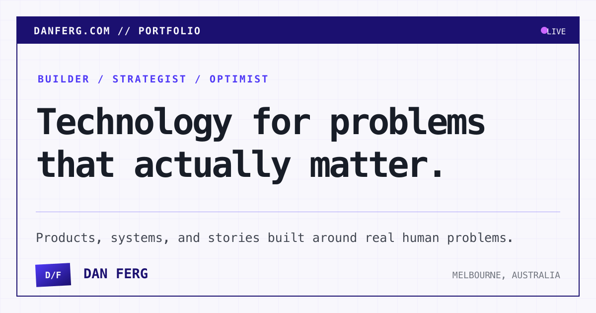

# danferg.com

[danferg.com](https://danferg.com) is Dan Ferg's personal website: a portfolio of products and experiments, a home for writing, and a place to explain his consulting and advisory work.

[](https://danferg.com)

## What is in the site?

- **Projects:** case studies spanning software, social impact, community technology, startups, and physical product experiments.
- **Articles and newsletters:** notes on building products, entrepreneurship, burnout, and lessons learned along the way.
- **Consulting:** an overview of the product, traction, go-to-market, and software work Dan takes on.
- **Talks and work history:** selected presentations and the experience behind the work.

The site is deliberately content-first. Most editorial pages are Markdown or MDX files, while Astro components provide the shared layouts and interactive details.

## Built with

- [Astro](https://astro.build/) and TypeScript
- [Tailwind CSS](https://tailwindcss.com/)
- Markdown and MDX content collections with schema validation
- [Motion](https://motion.dev/) and [Paper Shaders](https://shaders.paper.design/) for restrained interaction and visual effects
- [Sharp](https://sharp.pixelplumbing.com/) for generated social images

It is statically generated and includes responsive light and dark themes, RSS feeds, structured data, canonical metadata, a sitemap, robots directives, and Vercel deployment configuration.

## Run it locally

You will need:

- Node.js 22.12 or newer
- npm 10.8.2 or newer

```bash
git clone https://github.com/DanielFerguson/danferg.com.git
cd danferg.com
npm install
npm run dev
```

Astro will print the local development URL, usually [http://localhost:4321](http://localhost:4321).

No environment variables are required for local development.

## Useful commands

| Command | Purpose |
| --- | --- |
| `npm run dev` | Start the Astro development server. |
| `npm run check` | Run Astro and TypeScript diagnostics. |
| `npm run generate:og` | Regenerate the default and editorial social-sharing images. |
| `npm run build` | Generate social images, build the production site, and run the post-build audit. |
| `npm run audit:build` | Audit the generated site for metadata, structured data, links, feeds, image attributes, and performance budgets. |
| `npm run preview` | Preview the production build locally. |

For the closest local equivalent to the production verification flow, run:

```bash
npm run check
npm run build
```

## Project structure

```text
.
├── public/                  # Static files and generated social images
├── scripts/                 # Social-image generation and build auditing
├── src/
│   ├── assets/              # Images processed by Astro
│   ├── components/          # Shared UI and content components
│   ├── data/                # Small structured datasets used by pages
│   ├── layouts/             # Base, article, newsletter, and project layouts
│   ├── pages/               # Routes and Markdown/MDX content
│   ├── styles/              # Global styles and design tokens
│   └── content.config.ts    # Content collection schemas
├── astro.config.mjs         # Astro, sitemap, MDX, RSS, and Tailwind setup
└── vercel.json              # Redirects, caching, and security headers
```

## Working with content

Content lives alongside the routes it generates:

- `src/pages/projects/` contains project case studies.
- `src/pages/articles/` contains articles and research notes.
- `src/pages/newsletters/` contains archived newsletters.

Each entry uses frontmatter validated by the schemas in `src/content.config.ts`. When an article or newsletter is added or updated, `npm run build` also refreshes its social-sharing images and checks that the generated site remains internally consistent.

## Deployment

The repository is configured for a static Vercel deployment. The production build command is:

```bash
npm run build
```

The output is written to `dist/`. Redirects, caching rules, and response security headers are defined in `vercel.json`.

---

The website and its content are maintained by [Dan Ferg](https://danferg.com).
