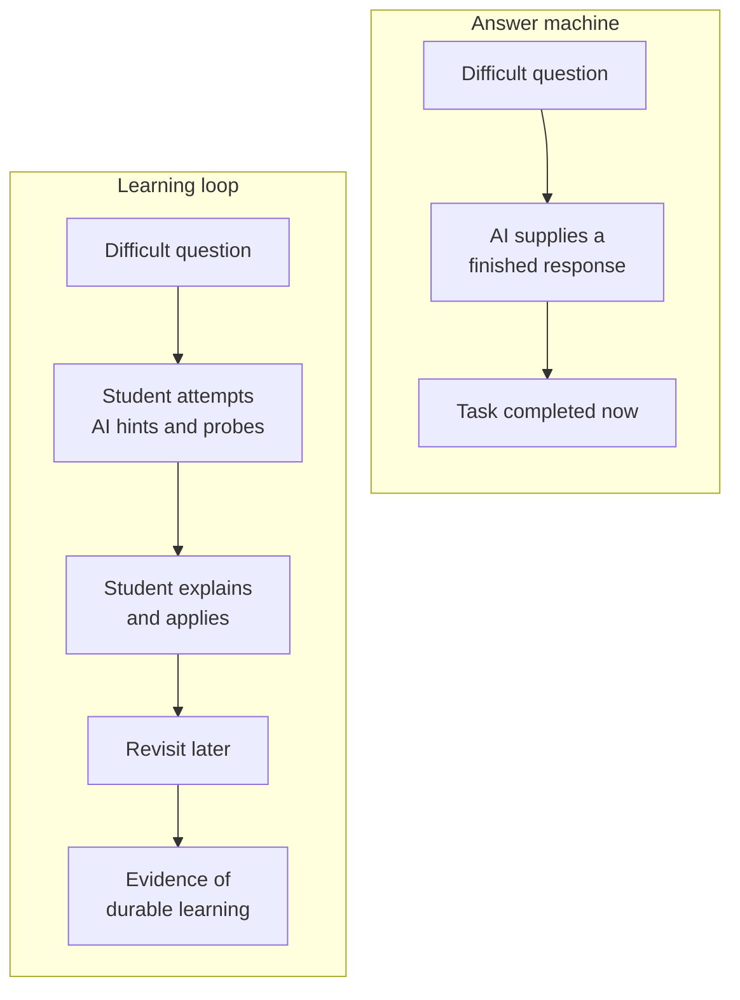
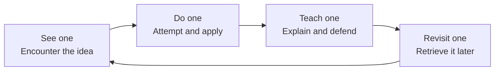
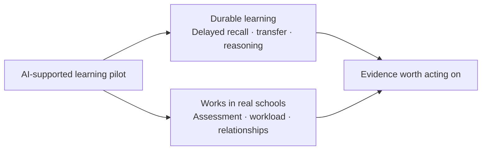

I keep coming back to a slightly uncomfortable question: **what if we're using artificial intelligence to make students better at completing schoolwork, but worse at learning?**

AI is very good at making an answer appear. Education has a different job: to change what a person can remember, explain, question and apply when the answer—and perhaps the AI—is no longer in front of them.

That distinction sounds obvious. I'm not sure our current products are designed around it.

Most general-purpose AI tools are rewarded for being helpful as quickly as possible. Ask a question, receive a polished response, move on. That's useful when the objective is to finish a task. It can work against learning when the student needs to retrieve and apply the idea later without assistance.

I've been thinking about what an alternative could look like: not an AI added to education as an answer machine, but AI deliberately built into the learning loop. Something that helps a student encounter an idea, attempt it, explain it, revisit it and gradually make it their own. Something that gives teachers better evidence of understanding while protecting the human relationship at the centre of education.

What follows isn't a finished model. It's a first-principles sketch that I want to test and pull apart.

## Performance is not the same as learning

The most useful warning I've found comes from a 2025 study involving nearly 1,000 high-school mathematics students. Students with access to a general-purpose GPT interface performed much better while practising, but then scored 17 per cent worse than the control group in an unassisted exam. A more carefully constrained tutor, designed to provide safeguards and teacher-authored hints, largely removed that penalty—but did not produce a clear improvement in the unassisted exam either. The researchers' conclusion wasn't that AI has no place in education. It was that [generative AI without guardrails can improve immediate performance while inhibiting learning](https://doi.org/10.1073/pnas.2422633122).

That gap between _doing well with the tool_ and _learning well enough to do without it_ feels like the heart of the problem.

It also gives us a better question. Instead of asking, “Did the AI help the student answer?”, we should ask, “What can the student now do that they could not do before?”

The early evidence is mixed, which is exactly why I think this deserves serious work. A 2025 randomised trial in an undergraduate physics course found that a carefully scaffolded AI tutor produced [larger immediate learning gains in less time than an active-learning class](https://www.nature.com/articles/s41598-025-97652-6). That's promising. It was also a study of 194 university students, across two lessons, with short-term post-tests. It doesn't tell us what will happen over a year in a Year 8 classroom.

A [2026 review of causal evidence on AI in K–12 education](https://scale.stanford.edu/sites/default/files/The%20Evidence%20Base%20on%20AI%20in%20K-12%20Report.pdf) reaches the more honest position: some tools improve supported performance, some structured tutors show promise, and outcomes for independent reasoning and durable learning remain mixed. Design, context and the learner all matter.

That uncertainty isn't a reason to wait for someone else to work it out. It's a reason to be precise about what we're trying to improve.

## Learning is not exposure

One of the ideas that started this train of thought was that learning is less about exposure than recall.

Reading a clear explanation can make a concept feel familiar. Recognition is comforting. It is also easy to mistake for understanding. The harder test is whether I can retrieve the idea later, explain it in my own words, connect it to what I already know and use it in a new situation.

The evidence for retrieval practice is well established. Actively bringing knowledge back to mind can produce [stronger long-term retention and more flexible transfer than repeatedly studying the same material](https://pubmed.ncbi.nlm.nih.gov/20951630/). Spacing matters too: reviewing an idea over time, rather than compressing every encounter into one session, can improve retention, although the useful interval depends on when the knowledge will be needed and what is being learned. A large experiment following learners for up to a year found that [the best gap between practice sessions grew with the desired retention period](https://pubmed.ncbi.nlm.nih.gov/19076480/).

This doesn't mean education should become an endless flashcard deck. Recall is necessary, not sufficient. I care about transfer: can the student recognise the same principle in an unfamiliar problem? Can they defend their reasoning? Can they spot when a rule no longer applies? Can they use knowledge to participate in a real discussion rather than simply reproduce a sentence?

The larger point is that durable learning requires the learner to do cognitive work. If AI removes all of that work, it may make the session feel successful while making the learning fragile.

## See one, do one, teach one—and revisit it

The rough model in my head began with an old phrase: **see one, do one, teach one**.

What if an AI-supported learning experience followed that sequence deliberately?

1. **See one.** A student encounters a concept through teacher-selected material, a demonstration, a worked example, a discussion or an explanation adapted to their current understanding.
2. **Do one.** The student attempts a problem or applies the idea. The AI can offer a graduated hint, ask a focusing question or show a partial example, but it should not immediately complete the work.
3. **Teach one.** The student explains the concept back. The AI becomes an examiner: asking “why?”, requesting another example, presenting a misconception or changing part of the problem to see whether the explanation still holds.
4. **Revisit one.** The system returns to the idea days, weeks and months later, in a different context and without assuming that one correct answer meant mastery.

I've been calling this an **Agentic Learning Loop**. Not because it needs a collection of chatbots with impressive job titles, but because the system should choose the next useful learning action. It should notice that an explanation is fluent but shallow, that a misconception has returned or that knowledge which looked secure a month ago is fading.

The “teach one” step is the part I find most interesting. Explaining something forces hidden gaps into the open. It asks the student to organise the idea rather than merely recognise it. But this, too, needs humility: research on learning by teaching finds benefits in some settings and null or negative effects in others. [How the explanation is prompted, supported and delivered matters](https://link.springer.com/article/10.1007/s10648-021-09643-4). A student delivering a polished but incorrect explanation to a passive chatbot isn't learning simply because we called the activity “teaching”.

The hypothesis worth testing is more specific: an interactive examiner that probes an explanation, checks it against teacher-approved material, reveals misconceptions and schedules later retrieval may turn teaching-back into a stronger learning activity.

## The teacher is not a bottleneck to automate away

When people remember their best teacher, they rarely begin with the mark they received on a test. They remember the person who believed in them, noticed what others missed, explained something in the way that finally made it click or made them feel that a subject might belong to them after all.

Teachers are mentors, experts, motivators and builders of culture. They read a room. They understand context that is not captured in a chat history. They know when a student needs a different explanation and when they need encouragement, safety, challenge or simply another day.

Those aren't inconveniently human parts of education. They're the point.

What teachers can't realistically provide is unlimited one-to-one time for every student. A teacher responsible for a room of students can't continuously tailor every explanation, remember every misconception, generate endless practice at exactly the right difficulty and revisit every concept at a personalised interval.

That's where I think AI could be useful: patient, adaptive practice; timely feedback; continuity between lessons; and a clearer view of where understanding is becoming secure or breaking down.

One study gives us an early example of AI amplifying educators rather than replacing them. In a randomised trial involving 900 tutors and 1,800 K–12 students, tutors given an AI “co-pilot” were more likely to ask guiding questions and less likely to give away answers. Their students were four percentage points more likely to master a topic, with larger gains for students working with lower-rated tutors. The authors also recorded very real failures, including suggestions that were inappropriate for the student's year level. It's a [promising human–AI result](https://doi.org/10.26300/81nh-8262), not permission to remove the human.

The division of labour I'm imagining is straightforward:

- The teacher owns learning goals, source material, classroom culture and consequential judgement.
- The AI provides individual practice, alternative explanations, probing questions and continuity at a scale a teacher cannot sustain alone.
- The student remains responsible for the thinking.

The goal isn't to give each student a synthetic relationship. It's to give each student more appropriate support—and give teachers more time and evidence for the relationships only they can build.

## A living model of understanding—not another grade

Today, assessment often has to compress a complicated human being into a mark. It is understandable. Schools need comparable measures, teachers have limited time and institutions need to make decisions.

AI may create the possibility of something more continuous.

Imagine a system that doesn't simply record that a student answered question 14 correctly. It records the explanation they gave, the hint they needed, the misconception they corrected, whether they could transfer the concept to a different problem and whether they could still retrieve it six weeks later. Over time, that becomes a living model of what the student appears to understand—and what evidence supports that view.

This shouldn't become an opaque score that follows a child around. The model would need to show its working, express uncertainty and remain open to correction by the student and teacher. It shouldn't infer intelligence, personality or potential from chat logs. It should help decide what to practise next, not place a ceiling on what someone is believed capable of learning.

Nor should an AI become the final grader for high-stakes decisions. It can assemble evidence, identify patterns and suggest where a teacher might look. Accountability remains human.

## What would count as success?

I think this needs two kinds of evidence.

The first is evidence of durable learning:

- Can students retrieve important ideas after one week, one month and six months?
- Can they apply those ideas to unfamiliar problems?
- Can they explain their reasoning and respond when it is challenged?
- Do recurring misconceptions become less frequent?
- Do students become more capable of directing their own learning?

The second is compatibility with the education system we actually have:

- Do students perform at least as well on existing tests and examinations?
- Do teachers gain useful time or simply inherit another system to manage?
- Can teachers see and act on patterns across a class?
- Does the approach strengthen rather than weaken teacher–student relationships?
- Does it improve access to personalised support without widening gaps elsewhere?

Time in the app, messages sent and questions completed are useful operational signals. They are not the outcome. Even an impressive practice score is not enough if the knowledge disappears once the support is removed.

The outcome I care about is **durable, transferable understanding**.

## A theory of change, for now

Here is my current argument in one paragraph:

> If students receive continuous, personalised guidance that preserves the cognitive work required for learning; if they are asked to retrieve, apply and explain knowledge over time; and if teachers can see trustworthy evidence of progress and difficulty, then more students should be able to build durable understanding, teachers should be better able to direct their limited time, and classrooms should become more responsive without surrendering the relationships and expertise that make education human.

There are assumptions inside that statement that must be tested.

I'm not claiming that every learner can master every subject to the same level. A more defensible principle is that, with appropriate time, support and instruction, far more learners can reach deep understanding than a one-to-many system currently enables. Instruction should adapt to the learner more often than the learner is forced to adapt to a single explanation.

I'm also not claiming that AI is necessarily the best way to provide that support. That's the research question, not the conclusion.

## Start in the classroom, with teachers

My first instinct was to imagine this as an after-school tutor. That's the easiest product shape: give a student a login, point it at their homework and keep the complexity away from the classroom.

I now think that framing is too small.

Learning doesn't begin at 9 am and stop at 3 pm. The same loop could continue through classroom instruction, independent practice and later retrieval. What matters is continuity. The teacher should be able to shape it; the student shouldn't have to re-explain their learning context to a disconnected tool every afternoon.

That makes the classroom the harder but more meaningful place to begin. I wouldn't arrive at a school with a finished “AI solution”. I would work with teachers and students to decide what deserves support, what must remain human and what evidence would make a pilot credible.

A sensible pilot would be deliberately narrow: one subject, one year level, one unit and teacher-approved material. It would compare assisted performance with delayed, unassisted recall and transfer. It would test teacher workload and student experience alongside marks. It would include students who struggle, students who already excel and students for whom a conversational interface creates accessibility barriers rather than removing them.

It would also treat governance as part of the educational design. The current [Australian Framework for Generative AI in Schools](https://www.education.gov.au/schooling/resources/australian-framework-generative-artificial-intelligence-ai-schools) provides useful minimums: respect teacher expertise, support critical thinking, be transparent, protect wellbeing and privacy, and design for fairness and inclusion. With minors, sensitive learning data and systems that can sound certain while being wrong, those can't be a compliance exercise added at the end.

## Why I'm writing this

I'm not a teacher or a learning scientist. My background is in designing and building AI-assisted products, including [Communiti Labs](/projects/communitilabs), where every conclusion needed to lead back to evidence and where technology was intended to support professional judgement rather than quietly replace it. That experience gives me a perspective; it doesn't give me the right to design a classroom alone.

This is why I want to approach the idea as a research collaboration before approaching it as a product.

The next work is to challenge the assumptions, build a more serious review of the science of learning, turn this rough theory of change into testable claims and design a pilot with the people who would actually live with it.

The question I want to put to teachers, students, school leaders, parents and researchers is specific: **where does this model break when it meets a real classroom?** If the idea has merit, it should survive contact with evidence, practice and disagreement.

[Tell me what I'm missing.](mailto:gday@danferg.com?subject=AI%20in%20the%20learning%20loop)
